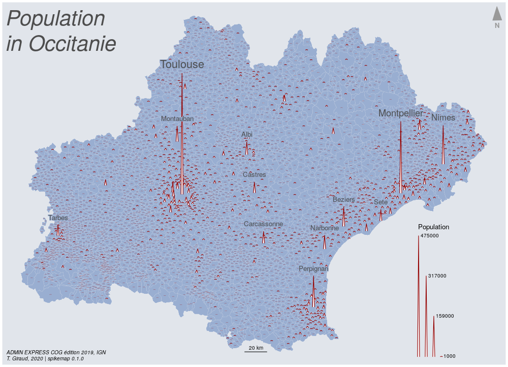

# spikemap

[](https://www.repostatus.org/#wip)


It is possible to map quantities with circles, squares or other simple 
geometric symbols, `spikemap` uses spikes.





## Installation
* Development version on GitHub
```{r}
require(remotes)
install_github("rCarto/spikemap")
```


## Demo

```r
library(sf)
library(spikemap)
library(cartography)

# import the dataset from the package
com <- st_read(system.file("gpkg/com.gpkg", package="spikemap"))

# save figure as spiky.png in img folder
png(filename = "img/spiky.png", width = 1000, height = 722, res = 100)
# set the margin of the figure
par(mar = c(0.2,0.2,0.2,0.2))

# plot the base map
plot(st_geometry(com), col="#99aed1", border = "#e1e5eb",
     lwd = 0.2, bg = "#e1e5eb")

# display spikes for municipalities under 1000 inhabitants.
# use fixmax arg to allow multiple spike plots with the same scale.
spikemap(x = com[com$pop<=1000, ], var = "pop",
         inches = 2.5, fixmax = 500000,
         col = "#ffffff90", border = "#94000090",  lwd = .5,
         legend.pos = "x")
# display spikes for other municipalities
# use locator() to pick a place for the legend or use "bottomleft".
spikemap(x = com[com$pop>1000, ], var = "pop",
         inches = 2.5, fixmax = 500000,
         col = "#ffffff", border = "#940000", lwd = 1.1,
         legend.pos = c(779307.2, 6128000),
         legend.title.txt = "Population",
         legend.values.rnd = -3)

# get the tips of the spikes
lbl <- spikelabel(x = com, var = "pop",
                  inches = 2.5, fixmax = 500000)
lbl <- lbl[order(lbl$pop, decreasing = T),]
# display only the 12 first, use various cex and halo
labelLayer(lbl[1:12,], txt = "name",
           pos = 3, offset = .5,
           halo = T, bg = "#99aed150",
           cex = c(1.3, 1.1, 1, rep(.8,12)),
           col = "grey30")

# add scale bar, north arrow, title, sources...
barscale(size = 20, pos= c(629638.7 ,6136862.3 ), lwd = 1)
north(pos = "topright", col = "grey60", x = com)
layoutLayer(title = "",
            sources = "ADMIN EXPRESS COG édition 2019, IGN",
            author = "T. Giraud, 2020 | spikemap 0.1.0",
            frame = FALSE, scale = FALSE)
mtext("Population \nin Occitanie",
      side = 3, adj = 0.01, padj = 0, line = -5,
      cex = 2.5, font = 3, col = "grey30")

dev.off()
```
   


## Gallery

  

  


## Inspiration

Inspiration from the New York Times front page maps by Lazaro Gamio, Karen Yourish and Bill Marsh (2020/04/08 edition).  


